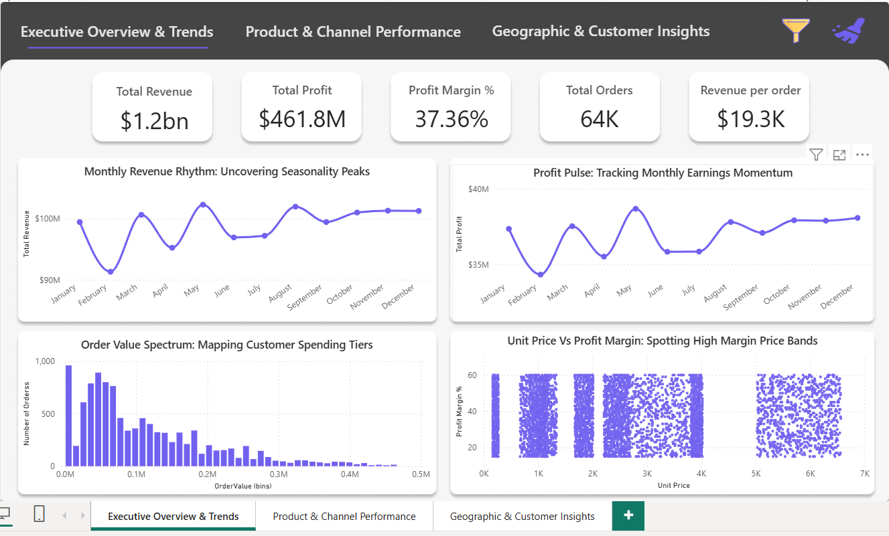
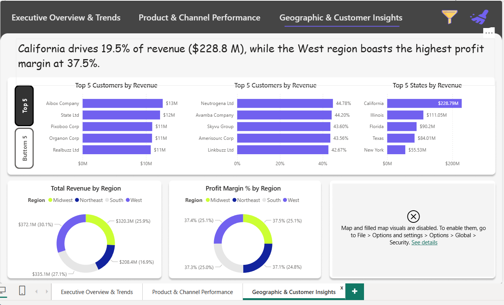
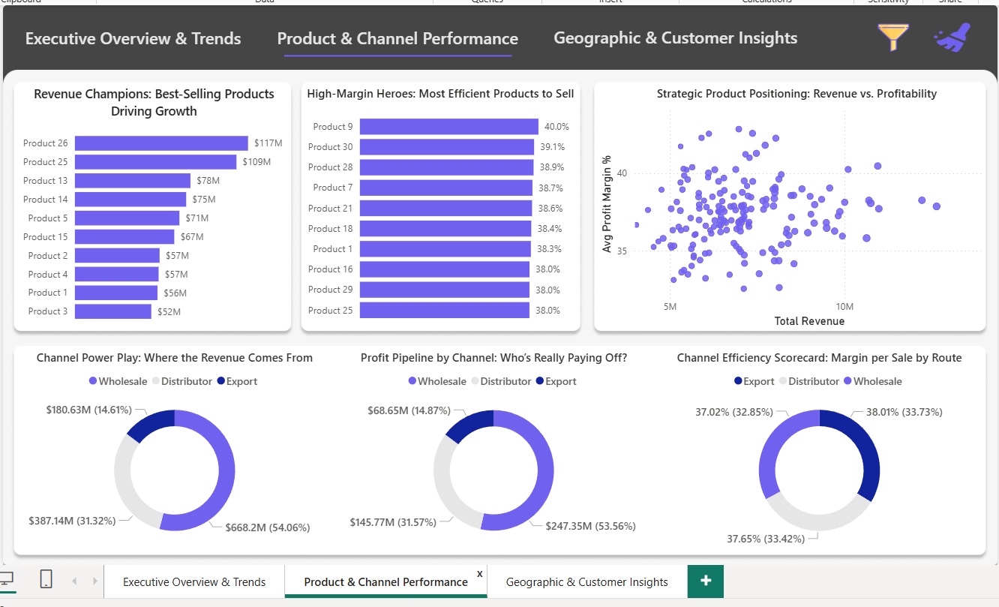

# 🧠 Regional Sales Analysis – End-to-End Data Analytics Project

## 📌 Overview
This project analyzes 5 years of U.S. sales data to uncover regional trends, product performance, and channel profitability. It demonstrates full-cycle analytics: from raw data wrangling to interactive dashboarding, delivering actionable insights for strategic decision-making.

---

## 🎯 Business Problem
Sales teams lacked visibility into seasonal swings, top SKUs, and channel efficiency. The goal was to build a data-driven framework to identify growth levers and optimize sales strategy across regions.

---

## 🛠️ Approach
- **Data Collection & Cleaning**: Merged multi-source Excel files, handled nulls, standardized schema
- **EDA & Feature Engineering**: Created profit metrics, normalized columns, joined relational tables
- **Visualization**: Used Python (Pandas, Seaborn) for trend analysis and Power BI for dashboarding
- **Recommendations**: Delivered insights on seasonality, product mix, channel strategy, and regional investment

---

## 📊 Dashboard Highlights

### 1. Executive Overview & Trends

- Total Revenue: $1.2B | Profit Margin: 37.36%
- Seasonality peaks in May–June, dip in January
- Profit and revenue trends tracked monthly
- Order value distribution and margin-price relationships visualized

### 2. Product & Channel Performance

- Top revenue SKUs: Products 26 & 25 ($117M, $109M)
- High-margin SKUs: Products 9, 30, 28 (≥38%)
- Channel breakdown: Wholesale (54%), Distributor (31%), Export (15%)
- Margin efficiency scorecard across channels

### 3. Geographic & Customer Insights

- California leads with $228.8M revenue
- West region shows highest profit margin (37.5%)
- Top customers: Aibox Company ($13M), State Ltd ($12M)
- Customer segmentation by revenue and margin

---

## 💡 Key Insights
- **SKU Concentration**: Top 2 products drive ~25% of revenue
- **Channel Trade-Off**: Export yields highest margins; Wholesale dominates volume
- **Regional Dominance**: California and West region outperform others
- **Customer Segmentation**: Mid-tier clients with high margins are upsell targets

---

## ✅ Recommendations
- Launch seasonal campaigns to smooth revenue dips
- Double down on high-performing SKUs; phase out low-margin products
- Expand Export partnerships for margin gains
- Replicate California’s success in other regions
- Monitor margin thresholds and flag underperforming orders

---

## 🧰 Tech Stack
- **Languages**: Python, SQL, R
- **Tools**: Power BI, Excel, Streamlit
- **Libraries**: Pandas, Seaborn, Matplotlib
- **Deployment**: GitHub-hosted portfolio with video walkthrough

Created By Chaitanya Kukwas
